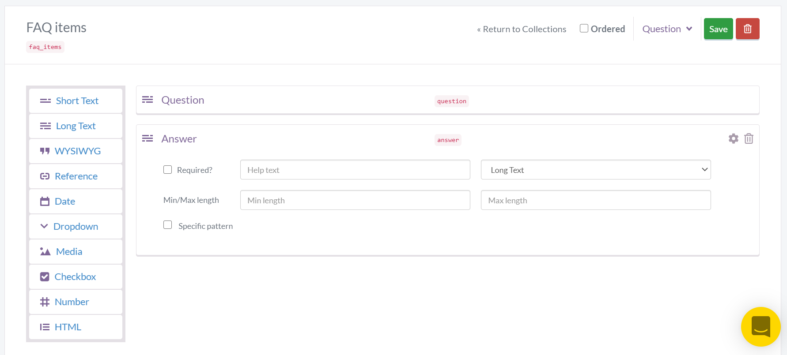

# CMS-powered application built with Vue 3

[](https://app.netlify.com/start/deploy?repository=https://github.com/butterCMS/buttercms-vue-3-tutorial)

[Vue.js](https://v3.vuejs.org/) is a progressive framework for building user interfaces.

[ButterCMS](https://buttercms.com) is a hosted API-based CMS and blog engine that lets you build CMS-powered apps using any programming language. You can think of Butter as similar to WordPress except that you build your website in your language of choice and then plug-in the dynamic content using an API.

This projects shows how to integrate ButterCMS into Vue.js application:

- How to create page with a list of blog posts and pages for each post. Learn more about blog integration [here](https://buttercms.com/docs/api/#get-your-blog-posts).
- How to dynamically create pages using data from ButterCMS pages. Learn more about fetching single pages and pages with types [here](https://buttercms.com/docs/api/#pages).
- How to display collections items on the page. Learn more on how to query collections [here](https://buttercms.com/docs/api/#retrieve-a-collection).
- How to get all posts categories. Learn more about categories [here](https://buttercms.com/docs/api/#categories).
- How to create pages with RSS, Atom, and Sitemap feeds. Learn more [here](https://buttercms.com/docs/api/#feeds).

Link to ButterCMS API documentation is https://buttercms.com/docs/api/.

## Important Notice
This project was created as an example use case of ButterCMS and Vue.js and will not be actively maintained. 

If you’re interested in exploring the best, most up-to-date way to integrate Butter into javascript frameworks like Vue, you can check out the following resources:

### Starter Projects

The following turn-key starters are fully integrated with dynamic sample content from your ButterCMS account, including main menu, pages, blog posts, categories, and tags, all with a beautiful, custom theme with already-implemented search functionality. All of the included sample content is automatically created in your account dashboard when you sign up for a free trial of ButterCMS.
- [Vue.js Starter](https://buttercms.com/starters/vuejs-starter-project/)
- [Angular Starter](https://buttercms.com/starters/angular-starter-project/)
- [React Starter](https://buttercms.com/starters/react-starter-project/)
- Or see a list of all our [currently-maintained starters](https://buttercms.com/starters/). (Over a dozen and counting!)

### Other Resources
- Check out the [official ButterCMS Docs](https://buttercms.com/docs/)
- Check out the [official ButterCMS API docs](https://buttercms.com/docs/api/)


## Set up ButterCMS account

1. Create a free account on ButterCMS - https://buttercms.com/.
2. To see the project locally you need to create this data in your account:
   - Create and publish customer case study pages (page with type `customer_case_study`) with this structure:
     
     Learn more about page types [here](https://buttercms.com/docs/api-client/vuejs#PagesPageType).
   - Create collection `faq_items` with this structure:
     
     Learn more about collections [here](https://buttercms.com/docs/api-client/vuejs#Collections).
3. Find your read API token from the home page or from settings page, it will be needed later.

## Requirements

- Node >= 12.0.0

## Running project locally

1. Clone and cd into project:

```
git clone https://github.com/ButterCMS/buttercms-vue-3-tutorial.git
cd buttercms-vue-3-tutorial
```

2. Install all dependencies

```
npm install
```

or

```
yarn install
```

1. Copy `.env.example` file as `.env` and replace `VUE_APP_BUTTER_CMS_API_KEY` value with your read API token
2. Run the app in development mode

```
npm run serve
```

or

```
yarn serve
```

The application should be available at `http://localhost:8080`.

To build the project run `npm run build`.
